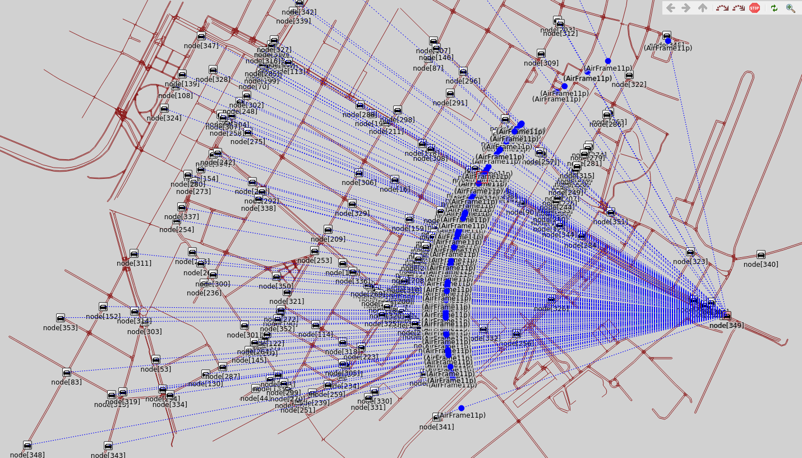
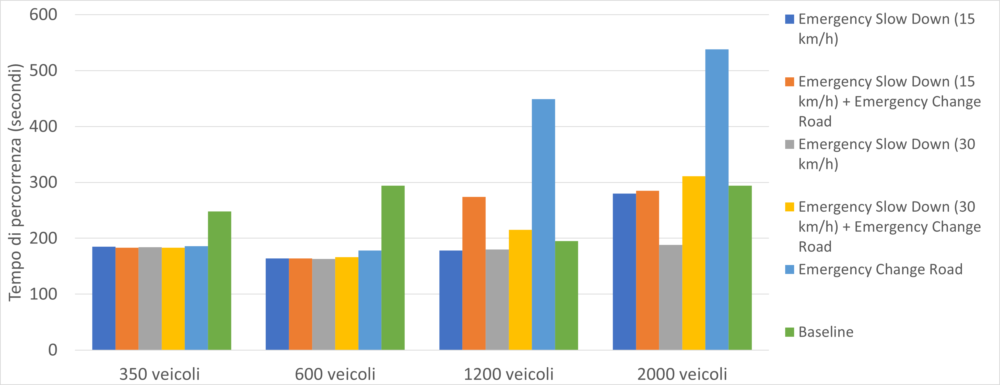
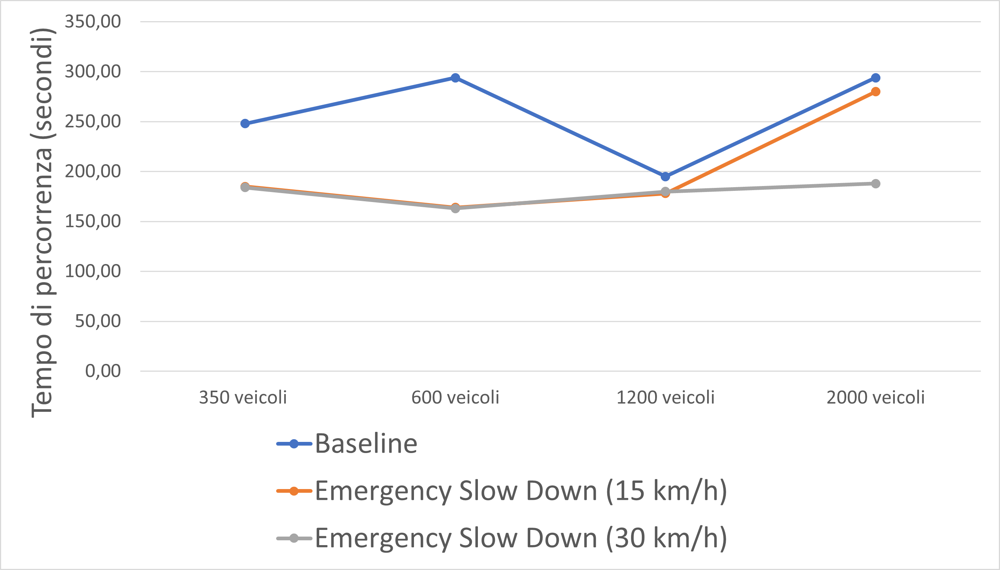

# Emergency-Vehicle-V2V-Priority
Master's Degree final thesis project: reduce emergency vehicles travel time using V2V communications in VEINS simulator.

The aim of my thesis was to design and test new heuristics to reduce emergency vehicles travel time from Modena's Hospital to anywhere in the city.
The considered baseline was the "blue light device" function included in SUMO simulator, which allows Emergency Vehicles to travel disregarding traffic lights and forces vehicles to form a virtual emergency lane.

Using OMNeT++ I developed custom messages which, when an Emergency Vehicle is at a certain distance, forces the traffic to behave in certain ways (our designed heuristics).

By editing the TraCIDemo11p.cc file you can choose which heuristic to apply when in range:
1) Slow down vehicles to a desired speed 
2) Stop vehicles
3) Force vehicles to change lanes

Finally you can combine those behaviours to further improve results.

We tested the heuristics in four different scenarios, from low to very high traffic (350, 600, 1200, 2000 vehicles) to verify both flexibility of usecases and the robustness of the solutions.

Overall in low and medium traffic scenarios we saw an improvement of 34.63% and 76.04% respectively, achieving up to 44.97% and 80.37% improvement in all scenarios using the Slow Down function set to 30km/h.

The example provided is set in Modena, but you can use any map you want by simple changing the OSM files (and remember to set the traffic you desire).

To use the project you simply need to extract all the files provided in this repository inside your VEINS installation folder, no need for further steps. Just remember to make a backup of your src and examples folder.

